# E-Sports WEB APP Welcome to the E-Sports WEB APP powered by Symfony!
## Overview
This repository hosts the source code for an advanced esports platform developed by Mohamed Bayoudh. The platform is designed to offer a comprehensive gaming experience, integrating innovative features for tournaments, products, teams, coaching, security, users, games, and more. It is attractive, user-friendly, and equipped with a comprehensive range of tools and features to satisfy both administrators and end-users, including visitors exploring the platform.

**Home of E-sports APP:**
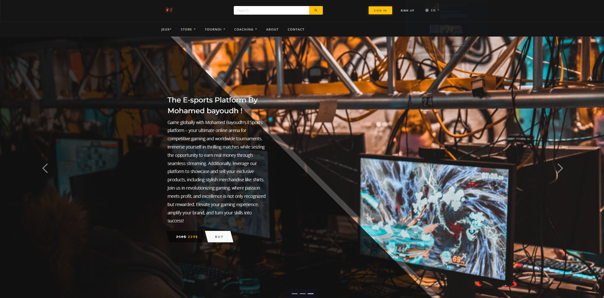
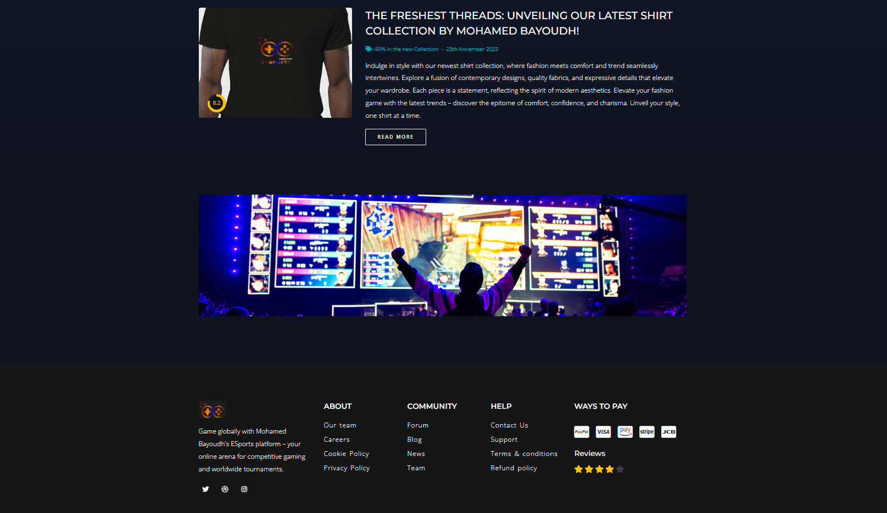

**Registration for E-sports APP:**
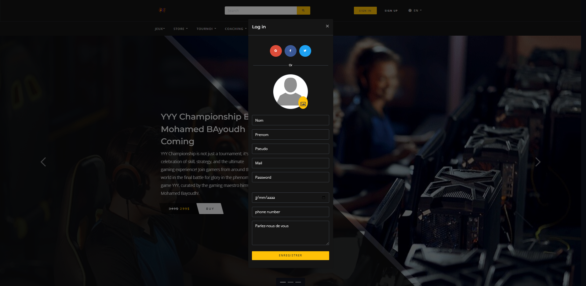

**Login for E-sports APP:**
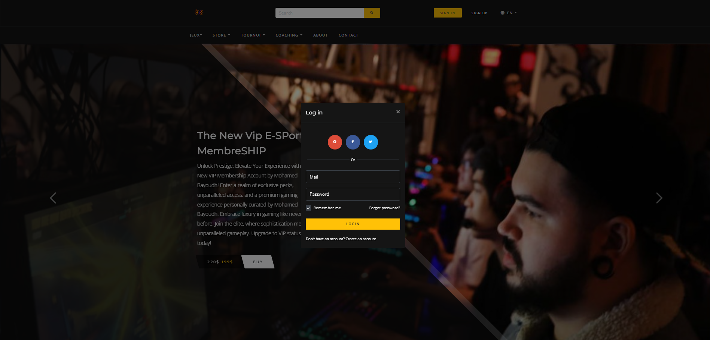
**User Dashboard:**
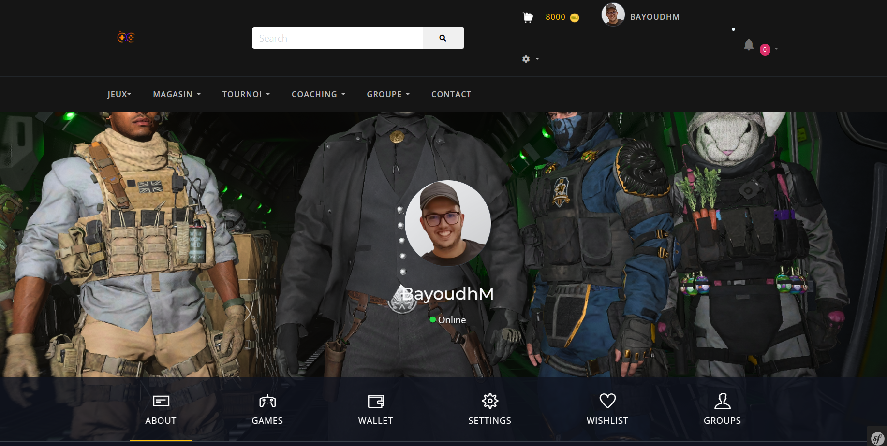
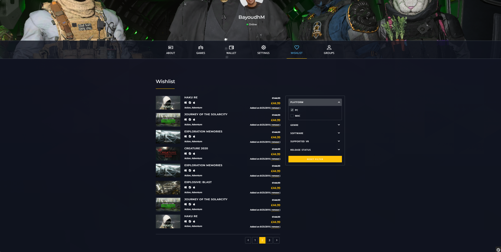

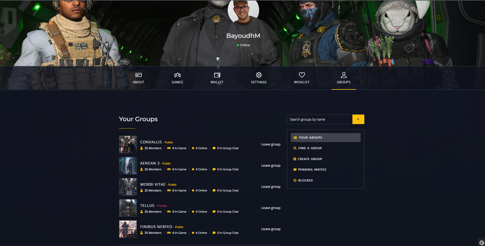
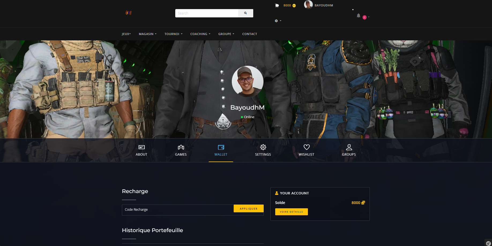
**Teams:"You must have a Team to make or rejoindre a Tournoi"**
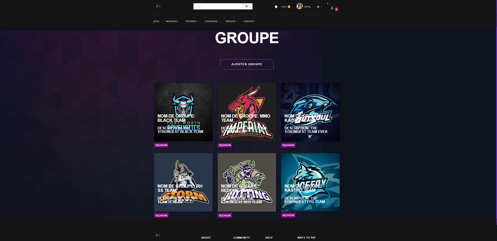
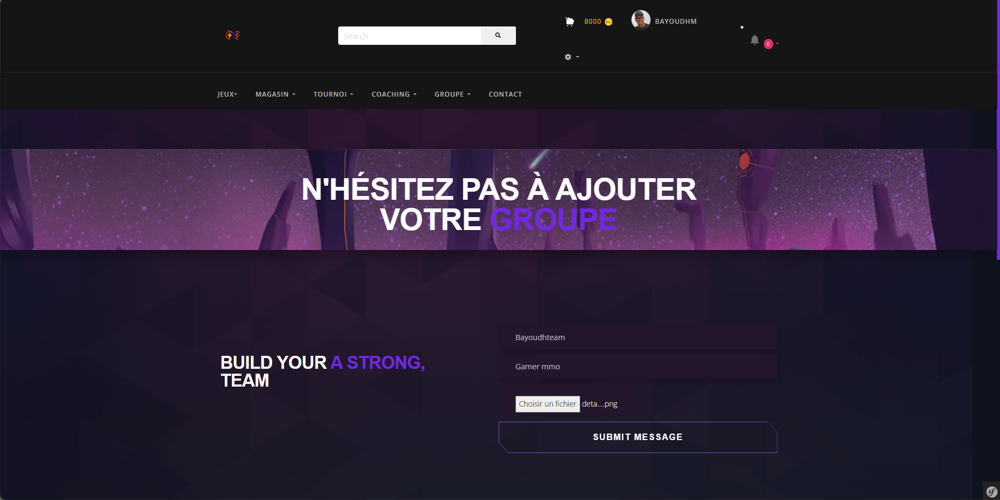
**Tournoi:**
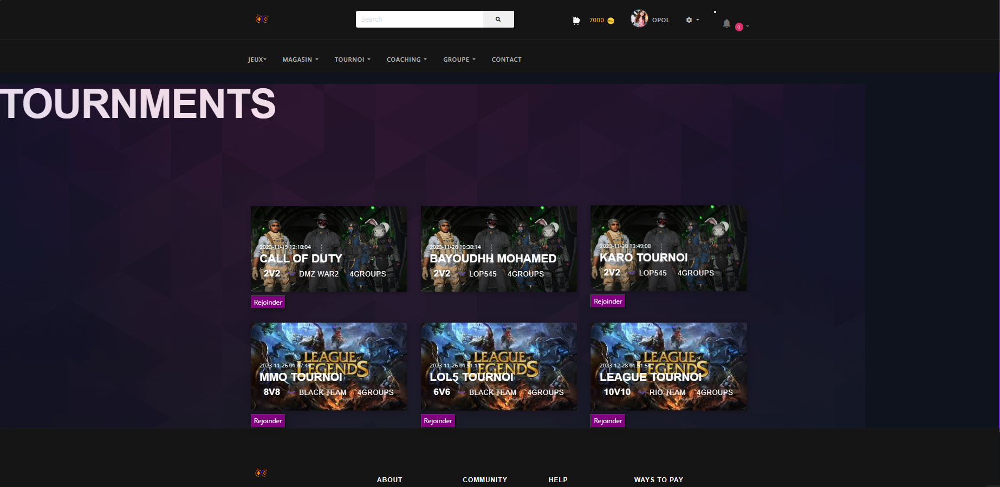
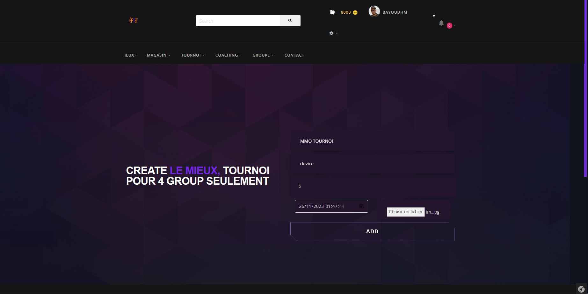
**Admin Control Center**
A robust set of admin features that serves as a centralized hub for overseeing various aspects, including tournaments, products, teams, coaching, security, users, and games.

### Admin Dashboard:
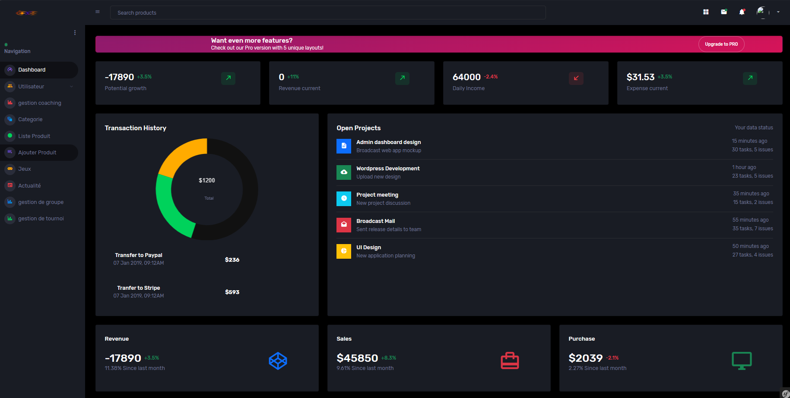
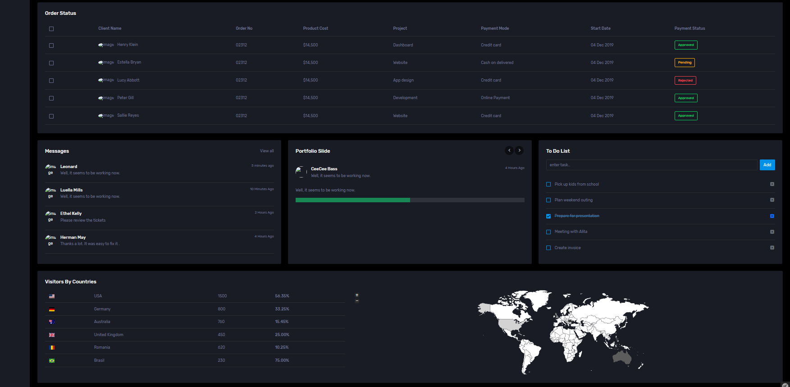
### Users Administration:
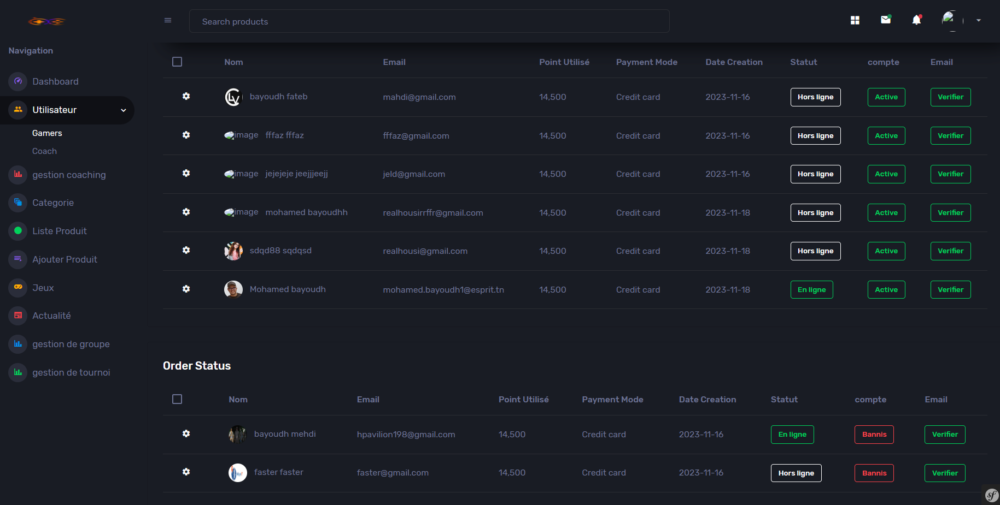
#### Team Management:
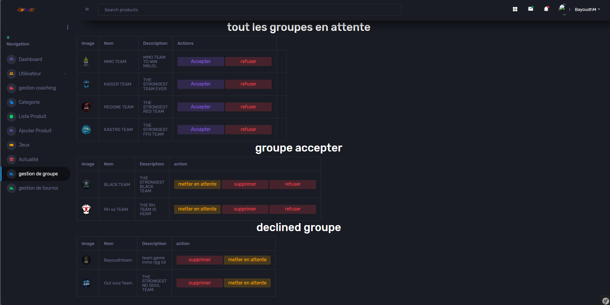
#### Game Administration:
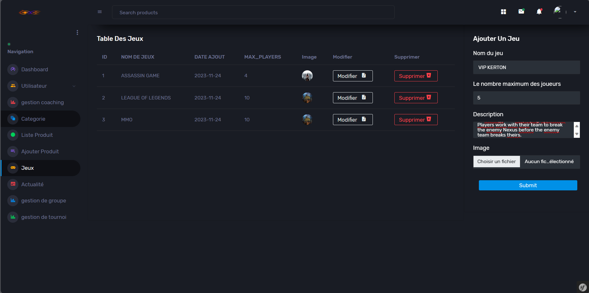

#### Product Management:
Efficiently manage a diverse range of products, spanning various categories including shirts and more. Effortlessly showcase, update, and oversee products available for sale with seamless efficiency.
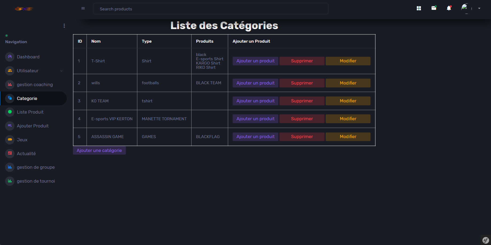
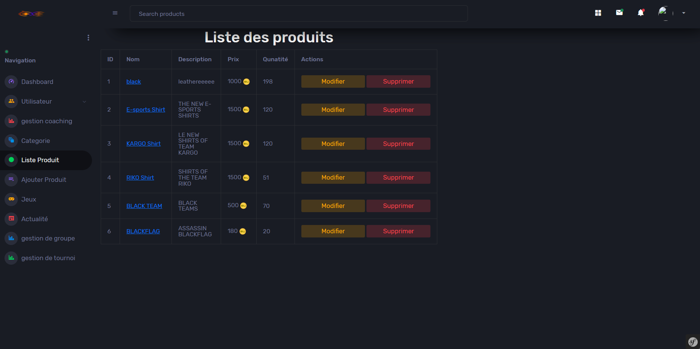
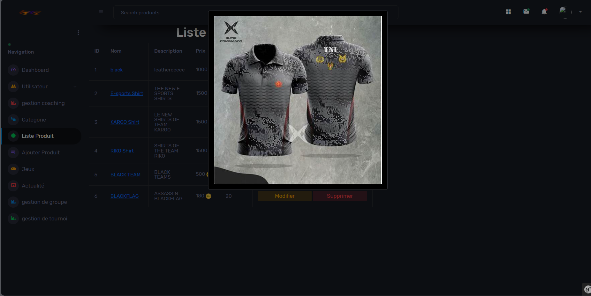
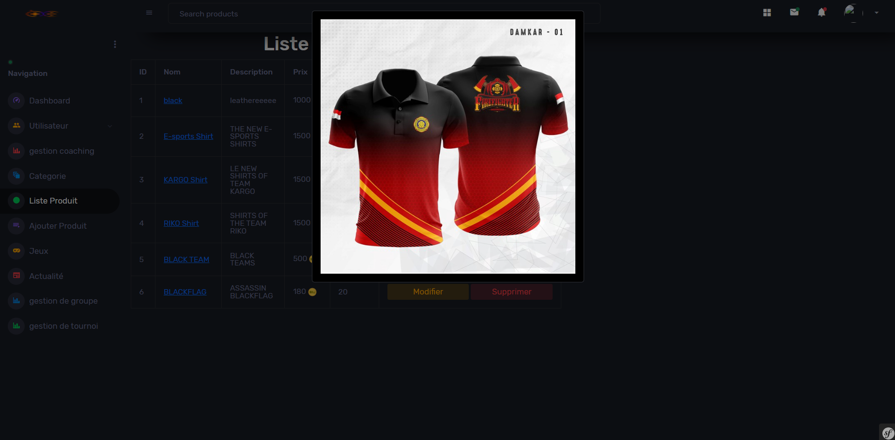

**"Note: The features mentioned above provide just a glimpse into the capabilities of this application. There are numerous additional features and functionalities implemented in the codebase that are not covered in this overview. Feel free to explore the source code to discover the full extent of the application's capabilities."**

